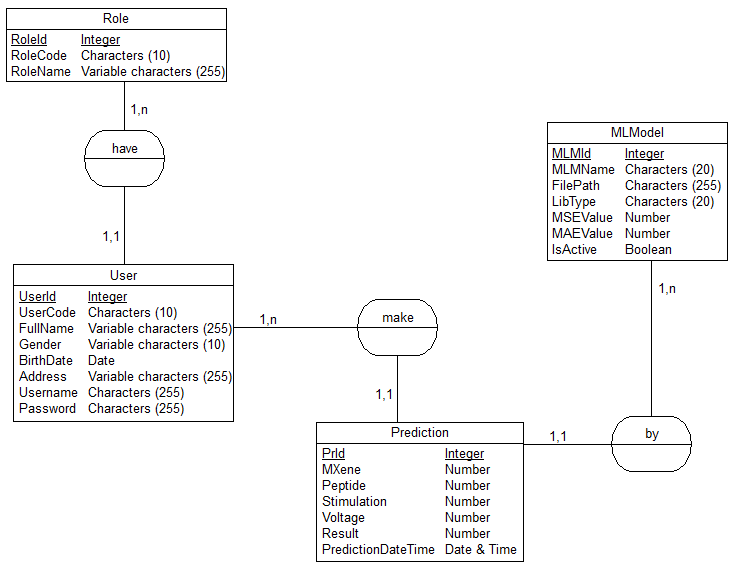
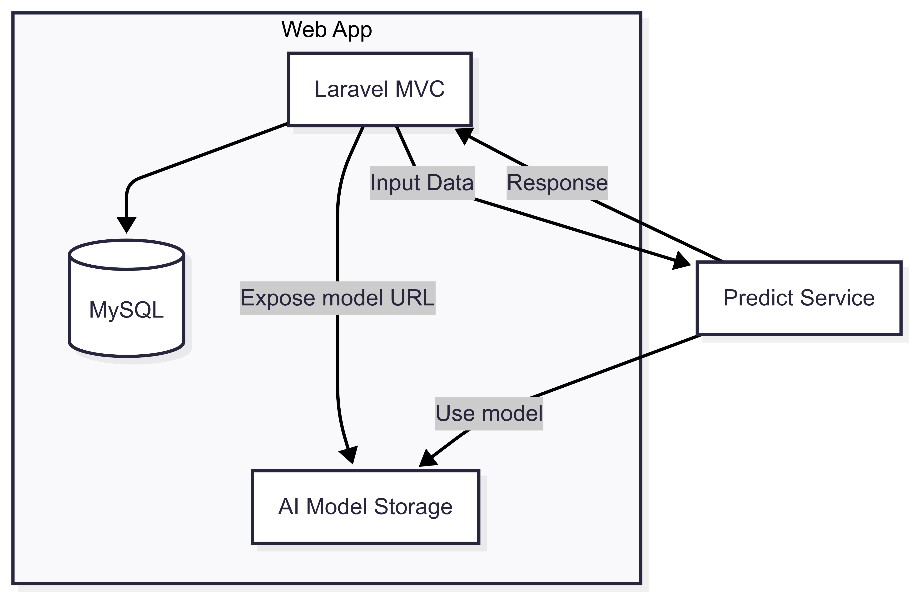

# WebApp - Laravel MVC Application

Laravel-based web application for Hydrogen Production Rate (HPR) Prediction System with user authentication, machine learning model management, and prediction functionality.

## 🚀 Features

- **User Authentication & Authorization** with role-based access control
- **Admin Panel** for user and ML model management
- **Machine Learning Integration** with external prediction service
- **Responsive UI** using Bootstrap and AdminLTE theme
- **File Upload & Management** for ML model files
- **Prediction History** with detailed analytics
- **Session Management** with secure authentication

## 🔬 Prediction Input Contract

The WebApp validates and forwards these **11 features** to the prediction service:

1. `ph`
2. `vss`
3. `ethanol`
4. `acetate`
5. `propionate`
6. `butyrate`
7. `sucrose_degradation`
8. `orp_mid`
9. `orp_low`
10. `vfa`
11. `cod_o`

Prediction output:
- `HPR` (`L/h/L`)

## 📋 Prerequisites

### System Requirements
- **PHP 8.4+** with required extensions
- **Composer** (PHP dependency manager)
- **Node.js & npm** (for frontend asset compilation)
- **Database** (MySQL/PostgreSQL/SQLite)

### Quick Installation Commands

**Windows:**
```powershell
Set-ExecutionPolicy Bypass -Scope Process -Force; [System.Net.ServicePointManager]::SecurityProtocol = [System.Net.ServicePointManager]::SecurityProtocol -bor 3072; iex ((New-Object System.Net.WebClient).DownloadString('https://php.new/install/windows/8.4'))
```

**Linux:**
```bash
/bin/bash -c "$(curl -fsSL https://php.new/install/linux/8.4)"
```

**macOS:**
```bash
/bin/bash -c "$(curl -fsSL https://php.new/install/mac/8.4)"
```

## 🛠️ Local Development

### 1. Install Dependencies

```bash
# Install PHP dependencies
composer install

# Install Node.js dependencies
npm install
```

### 2. Environment Configuration

```bash
# Copy environment file
cp .env.example .env

# Generate application key
php artisan key:generate
```

### 3. Database Setup

```bash
# Run migrations (select 'yes' if database doesn't exist)
php artisan migrate

# Seed the database with initial data
php artisan db:seed
```

### 4. Build Frontend Assets

```bash
# Build assets for production
npm run build
```

### 5. Start Development Server

```bash
# Start Laravel development server
php artisan serve
```

The application will be available at `http://localhost:8000`

## 🔄 Development Reload Commands

When making changes during development, use these commands to refresh the application:

```bash
# Rebuild frontend assets
npm run build

# Clear application cache
php artisan cache:clear

# Clear compiled views
php artisan view:clear
```

## 🏗️ Project Structure

```
WebApp/
├── app/
│   ├── Http/
│   │   ├── Controllers/         # Request controllers
│   │   └── Middleware/          # Custom middleware
│   ├── Models/                  # Eloquent models
│   │   ├── MLModel.php         # ML Model management
│   │   ├── Prediction.php      # Prediction records
│   │   ├── Role.php            # User roles
│   │   └── User.php            # User management
│   ├── Providers/              # Service providers
│   └── Services/               # Business logic services
│       ├── PredictionService.php # ML prediction service
│       └── UserService.php     # User management service
├── bootstrap/
│   ├── app.php                 # Application bootstrap
│   ├── providers.php           # Provider registration
│   └── cache/                  # Bootstrap cache
├── config/                     # Configuration files
│   ├── app.php                 # Application configuration
│   ├── auth.php                # Authentication configuration
│   ├── database.php            # Database configuration
│   └── ...                     # Other config files
├── database/
│   ├── factories/              # Model factories
│   ├── migrations/             # Database migrations
│   └── seeders/                # Database seeders
├── public/                     # Web accessible files
│   ├── index.php               # Application entry point
│   ├── build/                  # Compiled assets
│   ├── css/                    # CSS files
│   ├── images/                 # Image assets
│   ├── js/                     # JavaScript files
│   └── models/                 # Uploaded model files
├── resources/
│   ├── css/                    # Source CSS files
│   ├── js/                     # Source JavaScript files
│   └── views/                  # Blade templates
│       ├── admin/              # Admin panel views
│       ├── auth/               # Authentication views
│       ├── components/         # Blade components
│       ├── layouts/            # Layout templates
│       └── user/               # User dashboard views
├── routes/
│   ├── console.php             # Artisan commands
│   ├── test.php                # Test routes
│   └── web.php                 # Web routes
├── storage/
│   ├── app/                    # Application storage
│   ├── framework/              # Framework storage
│   └── logs/                   # Application logs
├── tests/                      # Test files
├── vendor/                     # Composer dependencies
├── artisan                     # Artisan CLI tool
├── composer.json               # Composer configuration
├── package.json                # npm configuration
├── phpunit.xml                 # PHPUnit configuration
└── vite.config.js              # Vite build configuration
```

## ✏️ System Design
- **Database diagram**:


- **Workflow diagram**:



## 🔧 Configuration

### Environment Variables

Key variables in `.env` file:

```env
# Application
APP_NAME="Hydrogen Production Rate Predictor"
APP_ENV=local
APP_KEY=base64:...
APP_DEBUG=true
APP_URL=http://localhost:8000

# Database
DB_CONNECTION=mysql
DB_HOST=127.0.0.1
DB_PORT=3306
DB_DATABASE=webapp
DB_USERNAME=root
DB_PASSWORD=

# External Services
PREDICT_SERVICE_URL=http://localhost:5000

#JWT Secret
JWT_SECRET=your_jwt_secret

# Mail Configuration (optional)
MAIL_MAILER=smtp
MAIL_HOST=smtp.mailtrap.io
MAIL_PORT=2525
```

### Key Dependencies

**Backend (PHP):**
- **Laravel 11.x**: PHP web framework
- **Laravel UI**: Authentication scaffolding
- **Guzzle**: HTTP client for API calls

**Frontend:**
- **Bootstrap 5**: CSS framework
- **AdminLTE**: Admin dashboard theme
- **Font Awesome**: Icon library
- **Chart.js**: Data visualization

## 🎯 User Roles & Permissions

### Administrator
- Full system access
- User management (CRUD operations)
- ML model management
- System configuration
- View all predictions

### Regular User
- Personal dashboard access
- Create predictions
- View own prediction history
- Profile management

## 🧪 Testing

### Running Tests

```bash
# Run all tests
php artisan test

# Run specific test suite
php artisan test --testsuite=Feature

# Run with coverage
php artisan test --coverage
```

### Test Accounts

After running the database seeder (`php artisan db:seed`), you can use these accounts to test the web application:

**Administrator Account:**
- **Username:** `admin`
- **Password:** `Admin@123`
- **Role:** Administrator (Full system access)

**Regular User Accounts:**
- **Username:** `testuser`
- **Password:** `Test@123`
- **Role:** User

- **Username:** `johnsmith`
- **Password:** `User@123`
- **Role:** User

- **Username:** `janewilson`
- **Password:** `User@123`
- **Role:** User

- **Username:** `mikebrown`
- **Password:** `User@123`
- **Role:** User

- **Username:** `sarahdavis`
- **Password:** `User@123`
- **Role:** User

> **Note:** Use the administrator account to access admin panel features and user management. Regular user accounts can be used to test user-specific functionality like creating predictions and viewing personal dashboard.

### Test Structure
- **Feature Tests**: End-to-end functionality testing
- **Unit Tests**: Individual component testing

## 🚨 Troubleshooting

### Common Issues

1. **Permission Errors**
   ```bash
   # Fix storage permissions
   chmod -R 755 storage/
   chmod -R 755 bootstrap/cache/
   ```

2. **Database Connection Issues**
   ```bash
   # Test database connection
   php artisan tinker
   >>> DB::connection()->getPdo();
   ```

3. **Asset Compilation Issues**
   ```bash
   # Clear npm cache
   npm cache clean --force
   
   # Reinstall dependencies
   rm -rf node_modules package-lock.json
   npm install
   ```

4. **Cache Issues**
   ```bash
   # Clear all caches
   php artisan cache:clear
   php artisan config:clear
   php artisan route:clear
   php artisan view:clear
   ```

5. **File Upload Issues**
   ```bash
   # Check storage link
   php artisan storage:link
   
   # Verify upload directory permissions
   ls -la public/models/
   ```

## 📊 Database Schema

### Key Tables
- **users**: User accounts and profiles
- **roles**: User role definitions
- **ml_models**: Machine learning model metadata
- **predictions**: Prediction records and results
- **sessions**: User session management

## 🔍 API Integration

The Laravel application integrates with external services:

- **Predict Service** (`http://localhost:5000`): ML prediction processing

### Service Communication
- RESTful API calls using Guzzle HTTP client
- JWT token-based authentication
- Error handling and retry logic

## 📈 Performance Optimization

### Production Optimizations

```bash
# Optimize autoloader
composer install --optimize-autoloader --no-dev

# Cache configuration
php artisan config:cache

# Cache routes
php artisan route:cache

# Cache views
php artisan view:cache

# Build optimized assets
npm run build
```

### Database Optimizations
- Proper indexing on frequently queried columns
- Eager loading for related models
- Query result caching for expensive operations

## 🔐 Security Features

- **CSRF Protection**: Cross-site request forgery protection
- **XSS Prevention**: Output escaping and validation
- **SQL Injection Prevention**: Eloquent ORM with prepared statements
- **File Upload Security**: Type validation and secure storage
- **Session Security**: Secure session handling
- **Password Hashing**: Bcrypt password hashing

## 📱 Responsive Design

The application features a fully responsive design that works across:
- Desktop computers
- Tablets
- Mobile phones

Built with Bootstrap 5 and custom CSS for optimal user experience on all devices.
